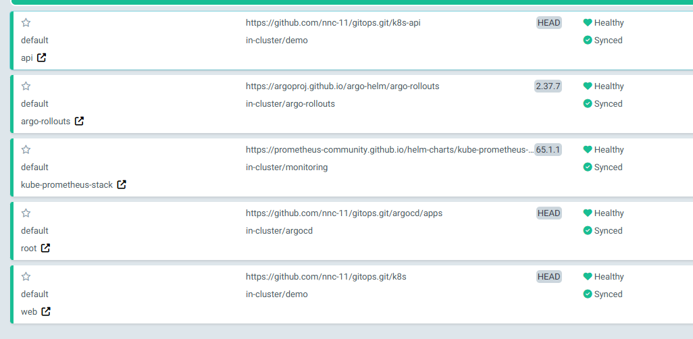
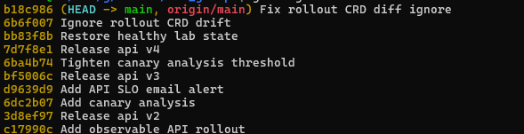
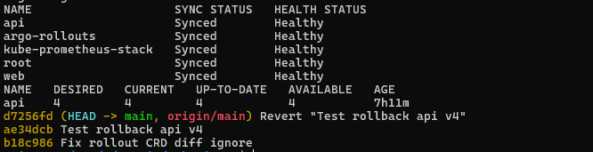
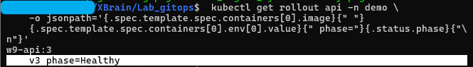
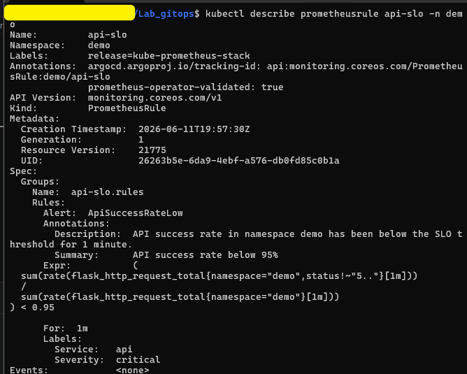
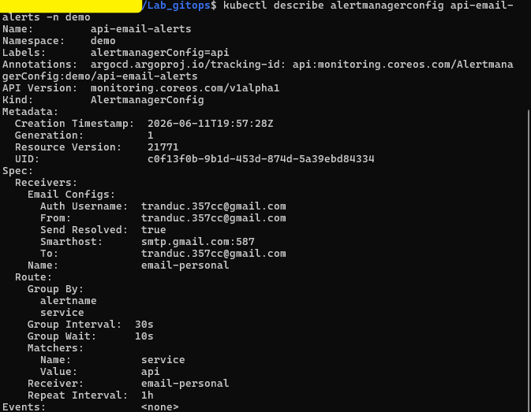
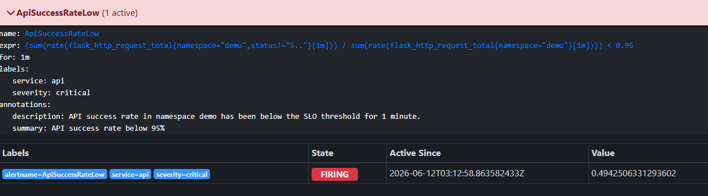
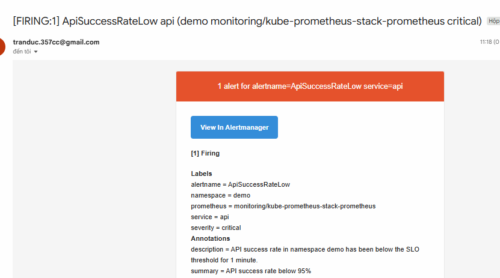
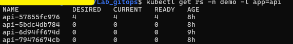
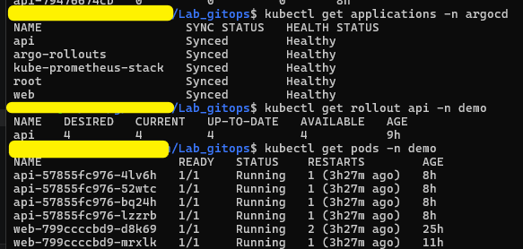

# Checklist chup evidence bai lab

Ngay: 2026-06-12

Muc tieu:

- GitOps thay doi qua Git, ArgoCD `Synced/Healthy`.
- Rollback bang `git revert` duoi 5 phut.
- SLO + alert fire ve email ca nhan.
- Canary ban loi tu abort ve ban cu.

## 1. ArgoCD

Lệnh:

```bash
kubectl get applications -n argocd
```

Cần thấy:

- `root`, `web`, `api`, `kube-prometheus-stack`, `argo-rollouts`
- Tat ca `Synced/Healthy`

Ảnh:



## 2. Git log

Lệnh:

```bash
git log --oneline --max-count=10
```

Cần thấy:

- Commit `Add canary analysis`
- Commit `Add API SLO email alert`
- Commit `Release api v3`
- Commit `Release api v4`
- Commit `Restore healthy lab state`

Ảnh:



## 3. Rollback

Mục tiêu:

- Tao commit test.
- Revert commit test bang `git revert`.
- API quay ve `w9-api:3/v3`.

Buoc 1 - tao commit test:

```bash
git add k8s-api/api.yaml
git commit -m "Test rollback api v4"
git push origin main
kubectl annotate application root -n argocd argocd.argoproj.io/refresh=hard --overwrite
```

Buoc 2 - rollback that:

```bash
date
time git revert HEAD --no-edit
git push origin main
kubectl annotate application root -n argocd argocd.argoproj.io/refresh=hard --overwrite
kubectl get applications -n argocd
kubectl get rollout api -n demo
git log --oneline --max-count=3
date
```

Cần thấy:

- Commit `Test rollback api v4`
- Commit `Revert "Test rollback api v4"`
- `api` ve `Synced/Healthy`
- `rollout api` ve `Healthy`
- Ban stable `w9-api:3/v3`

Ảnh:




## 4. SLO + alert email

Mục tiêu:

- Co rule SLO.
- Alert `ApiSuccessRateLow` fire.
- Nhan email ca nhan.

Lệnh:

```bash
kubectl describe prometheusrule api-slo -n demo
kubectl describe alertmanagerconfig api-email-alerts -n demo
```

Cần thấy:

- Alert `ApiSuccessRateLow`
- Nguong success rate `< 0.95`
- `For: 1m`
- Email `tranduc.357cc@gmail.com`

Ảnh:




Lệnh chay test alert:

```bash
kubectl delete pod bad-load good-load -n demo --ignore-not-found
kubectl run bad-load -n demo --image=busybox --restart=Never -- /bin/sh -c "while true; do wget -qO- http://api:5000/fail || true; sleep 1; done"
kubectl run good-load -n demo --image=busybox --restart=Never -- /bin/sh -c "while true; do wget -qO- http://api:5000/health > /dev/null || true; sleep 1; done"
kubectl port-forward svc/kube-prometheus-stack-prometheus -n monitoring 9090:9090
```

Mo:

```text
http://localhost:9090/alerts
```

Sau khi chup xong:

```bash
kubectl delete pod bad-load good-load -n demo --ignore-not-found
kubectl get pods -n demo
kubectl get applications -n argocd
kubectl get rollout api -n demo
```

Ảnh:




## 5. Canary auto-abort

Mục tiêu:

- AnalysisRun fail.
- Rollout auto-abort.
- ReplicaSet loi scale ve 0.

Lệnh:

```bash
kubectl get analysisrun -n demo
kubectl get analysisrun api-5bdc4db784-4 -n demo -o jsonpath='{.status.phase}{" "}{.status.metricResults[0].measurements[0].value}{"\n"}'
kubectl get rollout api -n demo -o jsonpath='{.status.phase}{" "}{.status.message}{" stableRS="}{.status.stableRS}{"\n"}'
kubectl get rs -n demo -l app=api
```

Cần thấy:

- `Failed < 0.95`
- `Rollout aborted update to revision 4`
- `stableRS` la ban cu
- `api-57855fc976` `READY 4`
- `api-5bdc4db784` `READY 0`

Ảnh:




## 6. Trang thai cuoi

Lệnh:

```bash
kubectl get applications -n argocd
kubectl get rollout api -n demo
kubectl get pods -n demo
```

Cần thấy:

- Tat ca app `Synced/Healthy`
- `rollout api` `Healthy`
- Pod `api` va `web` `Running`

Ảnh:


